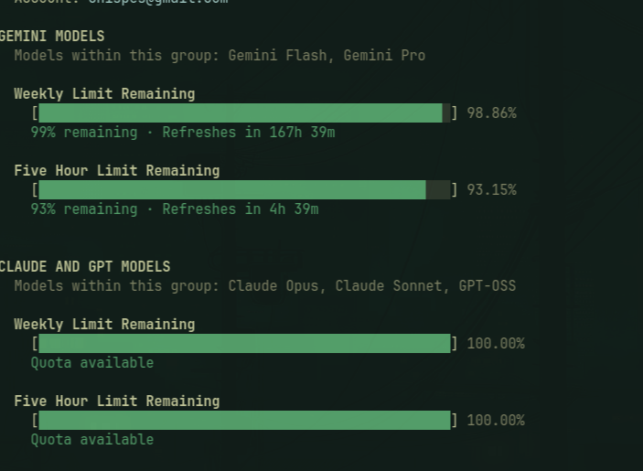

# omarchy-agent-gemini 🌟

> **Google Gemini / Antigravity usage, token collector, and rate limits plugin for Omarchy Linux.**

Integrates Google Gemini and Antigravity CLI (`agy`) tracking into Omarchy's official **Agents** (`omarchy.agents`) bar widget and dashboard.



---

## ✨ Features

- 📊 **Daily Token Consumption:** Displays 7-day token bar charts directly in the Omarchy panel.
- ⏱️ **Rate Limits & Quotas:** Draws the 5-hour session and 7-day weekly Gemini meters with their reset countdowns, plus any other bucket `agy` reports as used (the separate Claude/GPT weekly, for instance).
- 🤖 **Model Breakdown:** Shows token metrics grouped by model (e.g. `gemini-3.7-flash`, `gemini-2.5-pro`, `gemini-2.5-flash`).
- 💬 **Gemini CLI Support:** Reads the chat sessions the Gemini CLI records under `~/.gemini/tmp/<project>/chats/`, taking the token split straight from each response's `usageMetadata`.
- ⚡ **Antigravity CLI Support:** Reads sessions, prompt history, transcripts, and active account from `~/.gemini/antigravity-cli/`.
- 🔌 **Multi-Harness Scans:** Automatically aggregates Gemini sessions run through `opencode`, `pi`, and `omp`.
- 🎨 **Official Logos:** Ships the Google Gemini sparkle for dark and light surfaces (`install.sh --icons-only` puts it in the panel's root-owned assets dir).
- 🔒 **Zero-Config & Seamless:** Works alongside Omarchy's built-in Claude, Codex, and Fireworks collectors.

---

## 🚀 Installation

```bash
omarchy plugin add https://github.com/Chispes/omarchy-agent-gemini.git --enable
```

That is the whole install for the *data*: the plugin ships the collector and
runs it itself, so the Gemini tab, charts, and rate limits appear with no
`sudo` at all.

### The Gemini mark needs one root step

The Agents panel resolves a provider's icon by convention and by convention
only — `Qt.resolvedUrl("assets/<id>.svg")` against its own directory,
`$OMARCHY_PATH/shell/plugins/agents/assets/`, which is owned by root. A plugin
installed under `~/.config/omarchy/plugins` cannot write there, and the panel
never looks anywhere else, so until the mark is in place the tab is drawn with
the generic robot glyph. There is no plugin-side workaround; there is a
one-line install:

```bash
~/.config/omarchy/plugins/chispes.agent-gemini/install.sh --icons-only
omarchy restart shell
```

That copies `gemini.svg` and `gemini-light.svg` (light and dark surfaces) into
the panel's assets directory and touches nothing else. `uninstall.sh` removes
them again.

### Requirements

- Omarchy, with the Agents widget available (`omarchy.agents`)
- `python3` — the only runtime dependency; the collector uses the standard library alone.
- Antigravity CLI (`agy`) on `PATH`, for the rate-limit meters only. Without it
  the quotas are simply absent — token and session stats are read from files and
  need no CLI at all. Limits are probed with `agy -p /usage --output-format
  json`; the Gemini CLI has no `/usage` command, and an unknown slash command
  there would be sent to the model as a prompt, so it is never probed.

### Optional: install system-wide

```bash
~/.config/omarchy/plugins/chispes.agent-gemini/install.sh
```

The same script with no options installs the mark *and* the one other thing
that needs root: `/usr/bin/omarchy-agent-usage-gemini` plus the
`$OMARCHY_PATH/bin/omarchy-agent-usage-gemini` symlink, so Gemini refreshes as
part of `omarchy agent usage-update` alongside Omarchy's own collectors. The
plugin's own service already keeps the record fresh, so this is a convenience,
not a requirement.

It writes nowhere else and reads no user configuration. See
[Uninstallation](#-uninstallation) to undo it.

---

## 🔍 How it Works

The Agents panel is strictly a display: it watches
`~/.local/state/omarchy/agents/usage/` and draws every record it finds there,
whoever wrote it. That is the seam this plugin uses.

`omarchy-agent-usage-update` — the path Omarchy's own collectors take — only
globs `$OMARCHY_PATH/bin/omarchy-agent-usage-*`, a directory no plugin can
write to without root. So the plugin does not depend on it. `Service.qml` runs
the collector out of the plugin directory every 15 minutes with `--write`, and
the collector writes its own record. A system-wide install adds the update path
back; both refresh the same record by create-and-rename, so neither can be read
half-written.

Each run:

1. Reads the Gemini CLI's own chat sessions in `~/.gemini/tmp/<project>/chats/session-*.jsonl`,
   taking the token split from each response's `usageMetadata`.
2. Analyzes local Antigravity history (`~/.gemini/antigravity-cli/history.jsonl` & `conversation_summaries.db`).
3. Checks transcripts in `~/.gemini/antigravity-cli/brain/` for step and token metrics.
4. Queries `~/.local/share/opencode/opencode.db`, `~/.pi/agent/sessions/`, and
   `~/.omp/agent/sessions/` for assistant messages whose provider is Google.
5. Probes Antigravity rate limit quotas and reset timestamps, when `agy` is installed.
6. Detects the signed-in Google account from `~/.gemini/google_accounts.json`.
7. Writes the merged record to `~/.local/state/omarchy/agents/usage/gemini.json`.

### Why the tab may not appear

The panel hides an agent that has nothing to say: `providerHasData` in the
Agents widget requires at least one prompt, session, active day, or rate limit
before a tab is drawn, and the module leaves the bar entirely when no agent
qualifies. A machine that has never run Gemini therefore shows nothing, by
design — the tab arrives on its own at the next refresh once there is usage.
To see what the collector finds right now, without waiting for the service and
without writing anything:

```bash
python3 ~/.config/omarchy/plugins/chispes.agent-gemini/bin/omarchy-agent-usage-gemini --force | python3 -m json.tool
```

And to see the record the panel is actually drawing:

```bash
python3 -m json.tool ~/.local/state/omarchy/agents/usage/gemini.json
```

---

## 🛡 Resource bounds

The collector reads local history that the user's own tooling produces, so its
cost is bounded on every axis rather than left to grow with that history. All
limits are constants at the top of `bin/omarchy-agent-usage-gemini`:

| Bound | Value | What it protects |
|---|---|---|
| `HISTORY_CUTOFF_DAYS` | 30 | Work scales with a fixed window, not with total history |
| `MAX_DIR_ENTRIES_SCANNED` | 200000 | Global scan-work budget for one traversal |
| `MAX_ENTRIES_PER_DIR` | 4000 | One directory cannot spend the whole global budget |
| `MAX_DIRS_TO_SCAN` / `MAX_PENDING_DIRS` | 300 / 1000 | Directories visited, and pending paths retained |
| `MAX_TRANSCRIPT_FILES` | 100 | Files opened per scan |
| `MAX_FILE_SIZE_BYTES` | 4 MB | Per-file read budget, enforced on the open descriptor |
| `MAX_LINE_BYTES` | 256 KB | One line cannot be buffered without limit |
| `MAX_TAIL_BYTES` | 256 KB | `history.jsonl` is read as a seeked tail, never whole |
| `MAX_SESSIONS_RECORDED` / `MAX_MODELS_RECORDED` | 500 / 15 | Bounds the in-memory maps and the emitted JSON |

Directory traversal is a priority walk ordered by mtime (newest directories
first), so the budget is spent on recently active sessions before anything else:
what a truncated walk drops is the least recently touched material, which the
30-day cutoff would discard anyway.

File size is checked with `os.fstat()` on the descriptor being read, not with
`stat()` on the path, so a file swapped or grown between check and read cannot
escape the cap; opens use `O_NOFOLLOW`. Reads are chunked, so a file containing
no newlines is not pulled into memory as one enormous line.

---

## 🛠 Manual Usage & Testing

You can run the collector manually at any time:

```bash
python3 ~/.config/omarchy/plugins/chispes.agent-gemini/bin/omarchy-agent-usage-gemini --force --write
```

`--force` skips the 20-second scan cache, and `--write` updates the record the
panel reads; without `--write` it only prints. `--limits-only` reuses the
cached scan and refreshes just the rate-limit meters.

Omarchy's own refresh path discovers collectors by globbing
`$OMARCHY_PATH/bin/omarchy-agent-usage-*`, so it includes Gemini only after the
system-wide install:

```bash
omarchy agent usage-update --force        # every installed collector
omarchy agent usage-update gemini --force # just this one
```

To toggle the Agents panel from the terminal:

```bash
omarchy-shell omarchy.agents toggle
```

---

## 🗑 Uninstallation

Run `uninstall.sh` *first*, while the plugin directory still exists — it lives
inside it, and it is what removes anything the plugin could not have written
itself:

```bash
~/.config/omarchy/plugins/chispes.agent-gemini/uninstall.sh
omarchy plugin remove chispes.agent-gemini
```

`uninstall.sh` removes the Gemini mark, the system-wide collector and its
symlink if you installed them, and the generated record in
`~/.local/state/omarchy/agents/usage/gemini.json`. Each is removed only if
present, so it is safe after an `--icons-only` install, or after no install at
all.

Removing the plugin on its own leaves that record behind, and the panel draws
every record it finds regardless of who wrote it: the Gemini tab stays,
frozen at its last values, until the file is gone.

```bash
rm -f ~/.local/state/omarchy/agents/usage/gemini.json
```

---

## 📄 License

MIT © [Chispes](https://github.com/Chispes)
